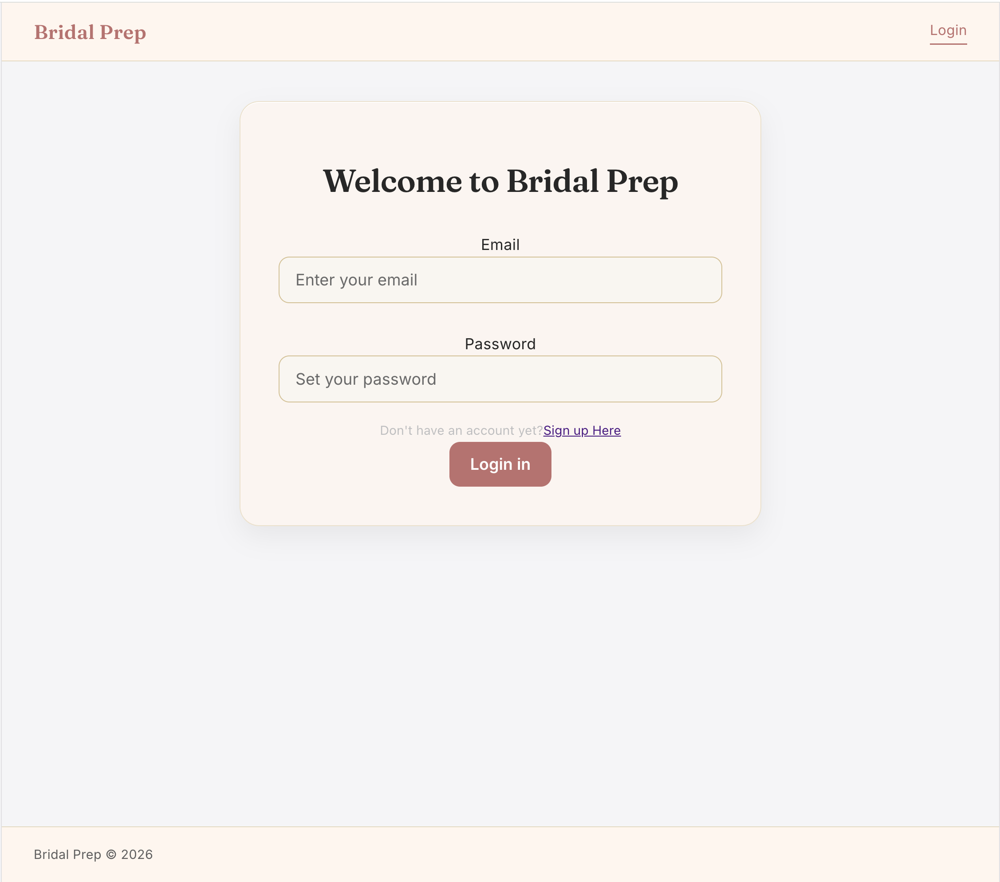
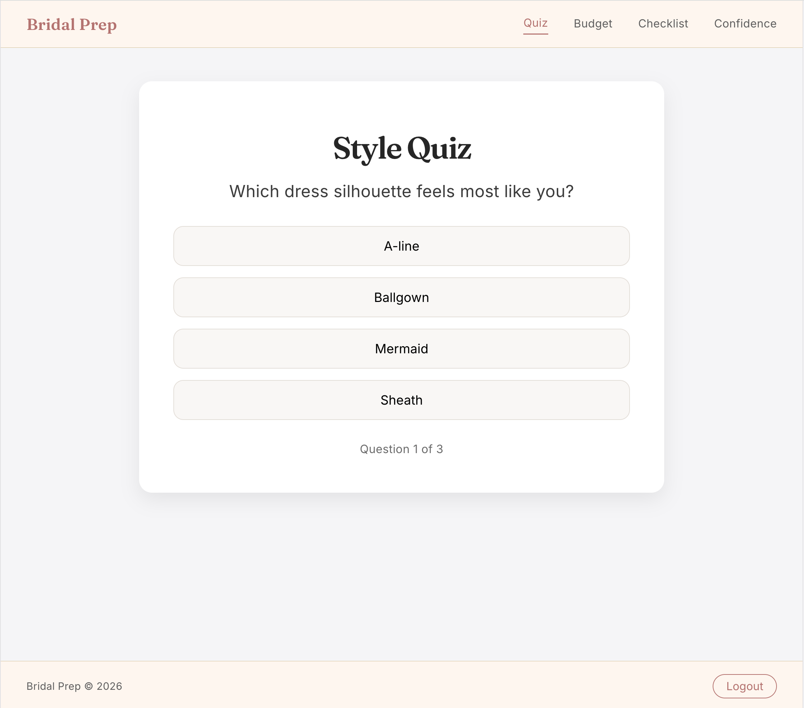
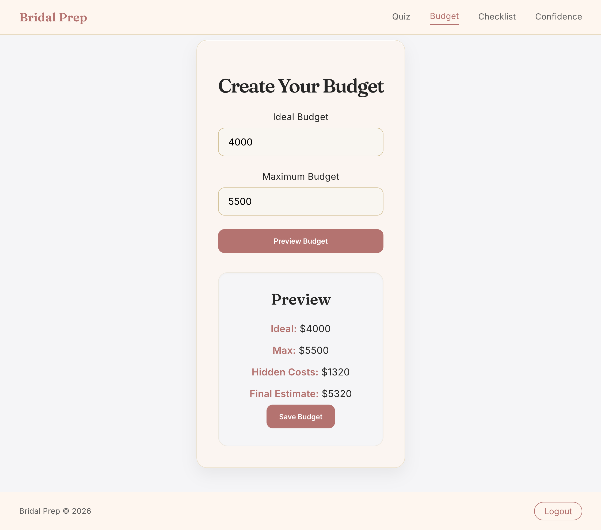
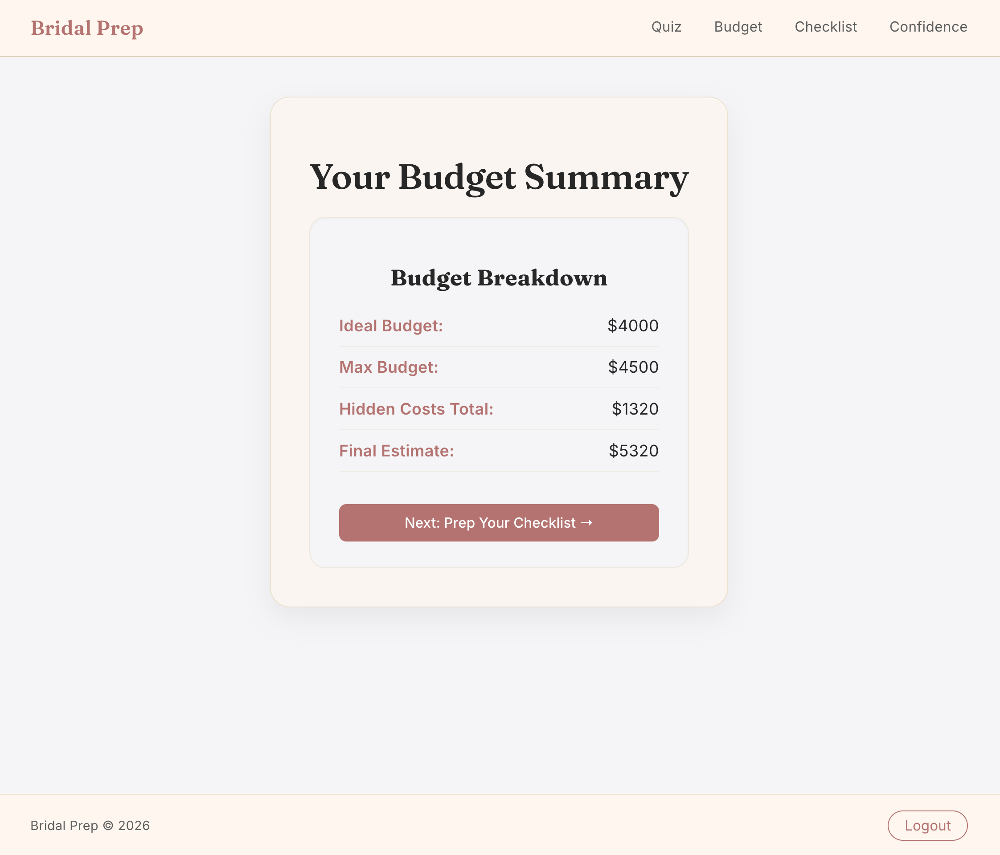
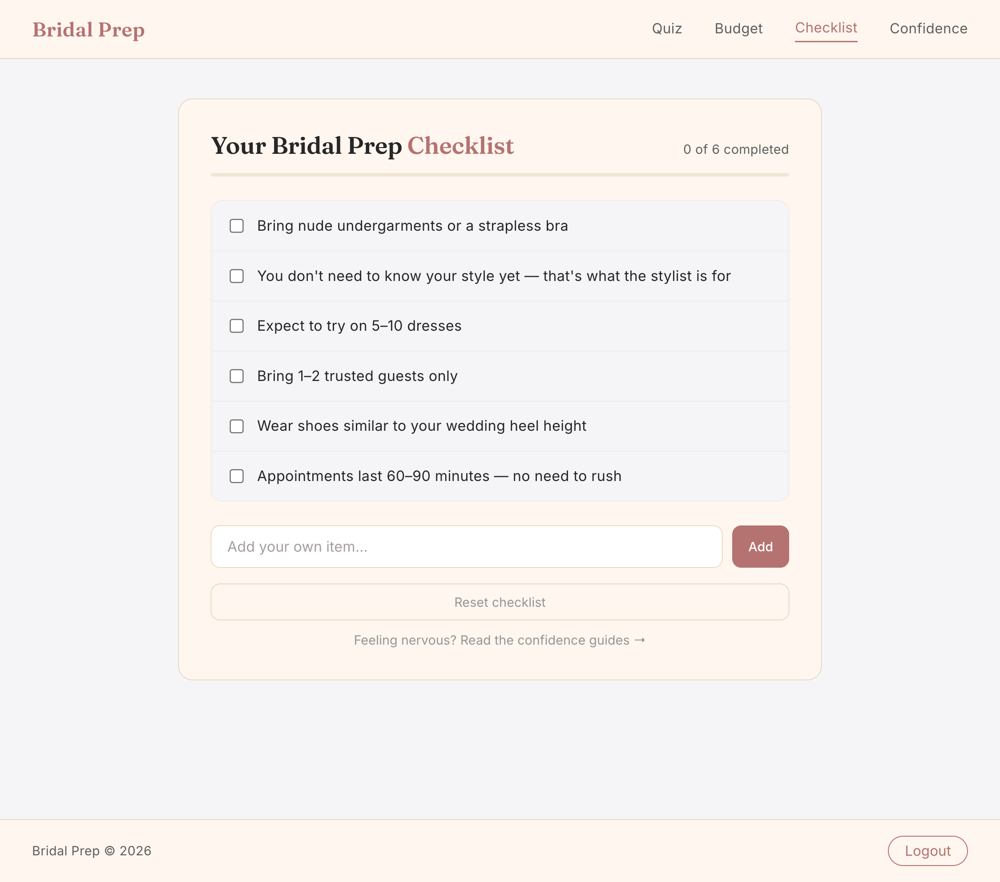
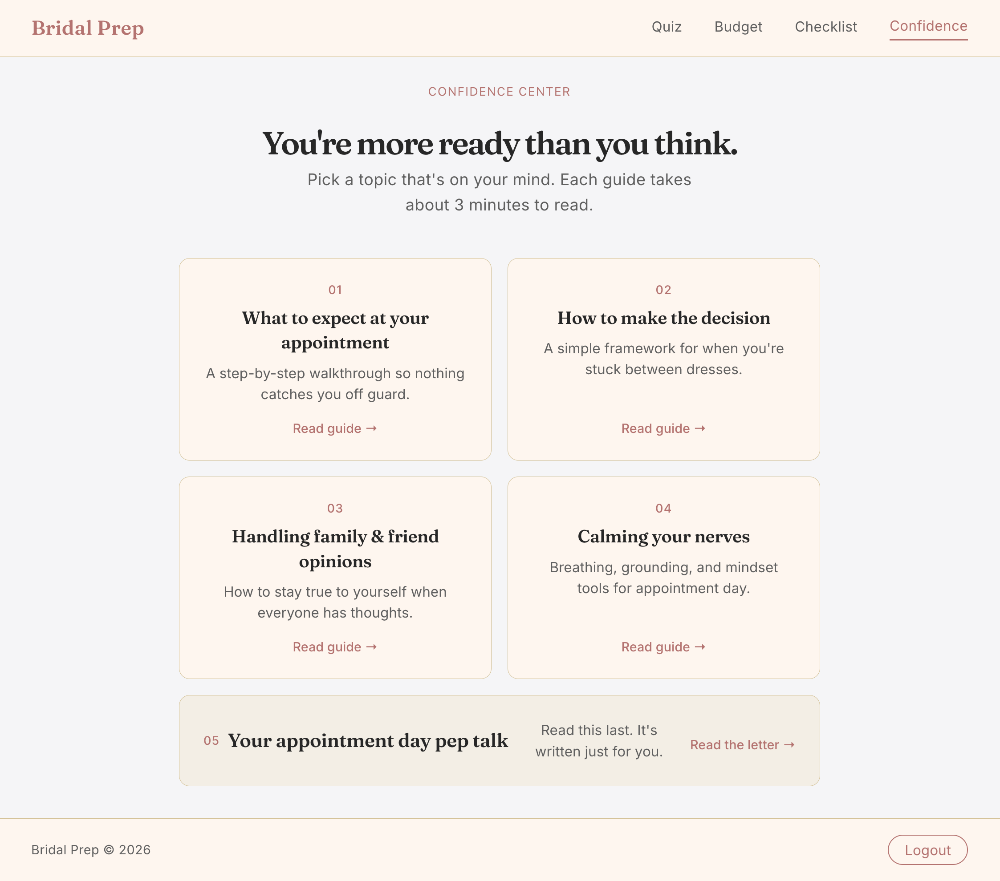

# Bridal Prep App 💍

[Redu's Final Project Doc](https://docs.google.com/document/d/1YIxb0eu9zeemv84UHcdmy3Q48qa55gNTxsJOdmFna_w/edit?tab=t.6f7ymtycmd16)

Bridal Prep is a PERN-stack web app designed to reduce overwhelm for brides by offering a guided style quiz, budget clarity, appointment preparation tools, and a confidence center. The goal is to turn "I don't know where to start" into "I'm ready."

## Features (MVP)

- Home dashboard with hero layout
- Global navbar with active link states
- Style Discovery Quiz
- Style Profile with Pinterest-style masonry image grid via Pexels API
- Budget Guide + Hidden Cost Calculator
- Appointment Prep Checklist with progress indicator and CRUD
- Confidence Boost section with 5 guided articles and sequential navigation

## Tech Stack

| Layer        | Technology                |
| ------------ | ------------------------- |
| Frontend     | React, Vite, React Router |
| Backend      | Node.js, Express          |
| Database     | PostgreSQL                |
| External API | Pexels API                |
| Deployment   | Render (FE + BE)          |

## Environment Variables

### Server (`server/.env`)

| Variable       | Description                  |
| -------------- | ---------------------------- |
| `DATABASE_URL` | PostgreSQL connection string |
| `NODE_ENV`     | App environment (see below)  |

### `NODE_ENV` Modes

| Value         | Description                                          |
| ------------- | ---------------------------------------------------- |
| `production`  | SSL enabled for database connection. Used on Render. |
| `development` | SSL disabled. Uses real PostgreSQL locally.          |
| `test`        | Uses a mock database pool. No real DB connection.    |

### Client (`client/.env`)

| Variable            | Description                                                      |
| ------------------- | ---------------------------------------------------------------- |
| `VITE_API_BASE_URL` | Base URL for all API requests (e.g. `http://localhost:3001/api`) |

## Getting Started

### Prerequisites

- Node.js
- PostgreSQL
- A Pexels API key

### Install Dependencies

```bash
# Frontend
cd client
npm install

# Backend
cd server
npm install
```

### Set Up Environment Variables

Create a `.env` file in `server/` and add:

```env
DATABASE_URL=your_postgres_connection_string
PEXELS_API_KEY=your_pexels_api_key
```

### Run the App

```bash
# Start the backend (from /server)
npm start

# Start the frontend (from /client, in a separate terminal)
npm run dev
```

Navigate to `http://localhost:5173` in your browser.

## Running Tests

```bash
# Frontend tests (from /client)
npm test

# Backend tests (from /server)
npm test
```

## Backend Overview

### Quiz API — `POST /api/quiz`

- Receives quiz answers
- Generates a style profile (placeholder logic)
- Fetches bridal images from Pexels (API-compliant)
- Inserts quiz result into PostgreSQL
- Returns JSON for frontend display

### Checklist API

- `GET /api/checklist/:userId` — fetch all items for a user
- `POST /api/checklist/:userId` — add a new item
- `PUT /api/checklist/:userId/:id` — toggle item completion
- `POST /api/checklist/:userId/reset` — reset checklist to defaults

### Budget API

- `GET /api/budget/:userId` — fetch latest budget
- `POST /api/budget` — preview and create a budget

### Additional Backend Work

- Added Pexels API client (`pexelsClient.js`)
- Added database test route
- Configured PostgreSQL pool with `search_path=bridal_prep`
- Added `dump.sql` for schema versioning

## Frontend Overview

### Pages

| Route                  | Page                        |
| ---------------------- | --------------------------- |
| `/`                    | Home Dashboard              |
| `/home`                | Home Dashboard              |
| `/quiz`                | Style Quiz                  |
| `/quiz/results`        | Quiz Results + Mood Board   |
| `/create-budget`       | Budget Guide                |
| `/budget`              | Budget Summary              |
| `/checklist`           | Appointment Prep Checklist  |
| `/confidence`          | Confidence Hub              |
| `/confidence/:guideId` | Individual Confidence Guide |

### Quiz Flow

- `QuizPage` wired into the router
- `QuizQuestion` component with option-selection UI
- Local state for current question, selected answers, and navigation
- Sends `answers` + `quiz_version` to the backend
- `QuizResults` displays style profile with sticky banner and Pinterest-style masonry image grid

### Checklist Feature

- `Checklist.jsx` + `ChecklistItem.jsx` — UI components with progress indicator
- `ChecklistPage.jsx` — page wrapper and routing entry
- `useChecklist.js` — data fetching, optimistic toggle, and item creation
- `checklistApi.js` — API integration layer
- Pre-loaded with 6 essential default items
- Full CRUD — add, toggle, delete, reset

### Budget Feature

- `BudgetGuide.jsx` + `BudgetBreakdown.jsx` — display components
- `BudgetPage.jsx` — page wrapper and routing entry
- `budgetApi.js` — API integration layer
- "Prep Your Checklist" CTA navigates bride to next step

### Confidence Feature

- `ConfidenceSection.jsx` — hub page with 5 topic cards
- `ConfidencePage.jsx` — individual guide page with sequential "Up next" navigation
- `confidenceData.js` — static content data file with all 5 guides
- Covers: what to expect, how to decide, handling opinions, calming nerves, pep talk
- Fully accessible — semantic buttons, aria-labels, aria-hidden decorative elements

### Home Dashboard + Navbar

- `HomeDashboard.jsx` — split layout hero with bridal image and Get Started CTA
- `Navbar.jsx` — sticky global navbar with active link states and aria-labels
- Accessible navigation with `aria-label="Main navigation"`

## Accessibility

A full accessibility sweep was completed across all major components:

- Semantic `<button>` elements for all interactive cards
- `aria-label` on all navigation and action buttons
- Decorative images marked with `alt=""` and `role="presentation"`
- Decorative arrows wrapped in `aria-hidden="true"`

## Database Schema

| Table             | Description                                    |
| ----------------- | ---------------------------------------------- |
| `users`           | User accounts                                  |
| `quiz_results`    | Stored quiz answers and style profiles         |
| `budgets`         | User budget entries and allocations            |
| `checklist_items` | Per-user checklist items with completion state |

## Design System

**Colors**

| Name         | Hex       |
| ------------ | --------- |
| Mist White   | `#F6F6F8` |
| Ivory Cream  | `#FFF7F1` |
| Clay Rose    | `#C57A7A` |
| Charcoal Ink | `#2C2C2C` |
| Golden Beige | `#DCC7A1` |

**Typography**

- Headings: Fraunces
- Body: Inter

## Deployment

- Backend deployed on Render
- Frontend deployed on Render
- FE ↔ BE connection tested
- CORS configured
- Pexels API key tested with sample calls

## Authentication & Authorization

This document covers the authentication and authorization implementation for the Bridal Prep App.
Overview
The auth system uses JWT (JSON Web Tokens) for stateless authentication and role-based access control for authorization. Roles are bride (default) and admin.

## Database

### Users Table

```sql
CREATE TABLE bridal_prep.users (
  id            SERIAL PRIMARY KEY,
  email         VARCHAR(255) NOT NULL UNIQUE,
  name          VARCHAR(100),
  password_hash TEXT NOT NULL,
  role          TEXT NOT NULL DEFAULT 'bride',
  created_at    TIMESTAMP DEFAULT now()
);
```

## Backend

### Auth Routes

| Method | Endpoint           | Access        | Description                                               |
| ------ | ------------------ | ------------- | --------------------------------------------------------- |
| POST   | `/api/auth/signup` | Public        | Validates input, hashes password with bcrypt, returns JWT |
| POST   | `/api/auth/login`  | Public        | Verifies credentials, returns JWT with userId + role      |
| POST   | `/api/auth/logout` | Public        | Stateless — client deletes the token                      |
| GET    | `/api/auth/me`     | Authenticated | Returns logged-in user from JWT                           |

### Admin Routes

| Method | Endpoint           | Access     | Description                                           |
| ------ | ------------------ | ---------- | ----------------------------------------------------- |
| GET    | `/api/admin/users` | Admin only | Returns all users — 401 if no token, 403 if not admin |

### Auth Middleware

Protects backend routes by verifying the JWT on every request. Sets `req.user = { id, role }` for downstream handlers.

```js
app.use('/api/budget', authMiddleware, budgetRoutes);
app.use('/api/checklist', authMiddleware, checklistRoutes);
app.use('/api/quiz', authMiddleware, quizRoutes);
```

## Frontend

### Pages

| File                   | Description                                                 |
| ---------------------- | ----------------------------------------------------------- |
| `pages/LoginPage.jsx`  | Login form — navigates to `/quiz` on success                |
| `pages/SignUpPage.jsx` | Signup form — saves token, navigates to `/quiz`             |
| `pages/AdminPage.jsx`  | Admin dashboard — lists all users with delete functionality |

## Testing

### Frontend

```bash
cd client
npm test
```

### Backend

```bash
cd server
npm test
```

---

## Environment Variables

Add to `server/.env`:

## Previews










